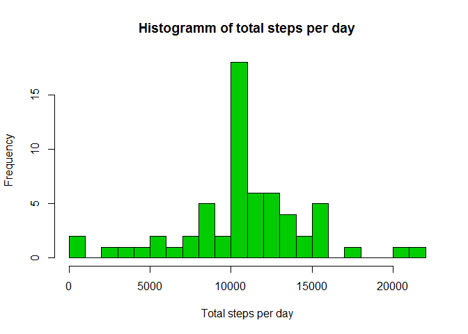

# Reproducible Research: Peer Assessment 1


## Loading and preprocessing the data

```r
activityZip <- 'activity.zip';
activityFilename <- 'activity.csv';
if (!file.exists(activityFilename))
        unzip(activityZip);

activity <- read.csv(activityFilename, header = TRUE, na.strings = "NA");

summary(activity)
```

```
##      steps                date          interval     
##  Min.   :  0.00   2012-10-01:  288   Min.   :   0.0  
##  1st Qu.:  0.00   2012-10-02:  288   1st Qu.: 588.8  
##  Median :  0.00   2012-10-03:  288   Median :1177.5  
##  Mean   : 37.38   2012-10-04:  288   Mean   :1177.5  
##  3rd Qu.: 12.00   2012-10-05:  288   3rd Qu.:1766.2  
##  Max.   :806.00   2012-10-06:  288   Max.   :2355.0  
##  NA's   :2304     (Other)   :15840
```

## What is mean total number of steps taken per day?

Aggregate activity by date - sum steps for each day

```r
aggregatedByDate <- aggregate(. ~ date, data=activity, FUN = sum);
```

Histogram of total steps per day

```r
hist(aggregatedByDate$steps, breaks = 30, xlab = "Total steps per day", main = "Histogramm of total steps per day", col=3);
```

<!-- -->

Calculate mean of total steps per day 

```r
meanTotalSteps <- mean(aggregatedByDate$steps);
meanTotalSteps
```

```
## [1] 10766.19
```

Calculate median of total steps per day 

```r
medianTotalSteps <- median(aggregatedByDate$steps)
medianTotalSteps
```

```
## [1] 10765
```

## What is the average daily activity pattern?
Aggregate activity by intervals - average steps for each interval    


```r
aggregatedByInterval <- aggregate(steps ~ interval, data=activity, FUN = mean);
```

Plot of average steps per interval

```r
plot(x = aggregatedByInterval$interval, y = aggregatedByInterval$steps, type = "l", xlab = "Interval", ylab="Average steps" )
```

<!-- -->

Which interval has the maximum number of steps averaged by day

```r
aggregatedByInterval[which.max(aggregatedByInterval$steps), ];
```

```
##     interval    steps
## 104      835 206.1698
```


## Imputing missing values

Total number of missing values in the dataset (i.e. the total number of rows with NAs)

```r
sum(!complete.cases(activity))
```

```
## [1] 2304
```

Fill out missing values with average value for interval

```r
activityNoNA <- activity;
for (i in 1:nrow(activityNoNA)) {
    if (is.na(activityNoNA$steps[i])) {
        activityNoNA$steps[i] <- aggregatedByInterval[activityNoNA$interval[i] == aggregatedByInterval$interval, ]$steps;
    }
}

summary(activityNoNA)
```

```
##      steps                date          interval     
##  Min.   :  0.00   2012-10-01:  288   Min.   :   0.0  
##  1st Qu.:  0.00   2012-10-02:  288   1st Qu.: 588.8  
##  Median :  0.00   2012-10-03:  288   Median :1177.5  
##  Mean   : 37.38   2012-10-04:  288   Mean   :1177.5  
##  3rd Qu.: 27.00   2012-10-05:  288   3rd Qu.:1766.2  
##  Max.   :806.00   2012-10-06:  288   Max.   :2355.0  
##                   (Other)   :15840
```

Histogram of the total number of steps taken each day 

```r
aggregatedByDateImputed <- aggregate(. ~ date, data=activityNoNA, FUN = sum);
hist(aggregatedByDateImputed$steps, breaks = 30, xlab = "Total steps per day", main = "Histogramm of total steps per day", col=3);
```

<!-- -->
 
Imputing effect on estimates 

Mean imputed total steps:

```r
meanImputedTotalSteps <- mean(aggregatedByDateImputed$steps)
meanImputedTotalSteps
```

```
## [1] 10766.19
```

Median imputed total steps:

```r
medianImputedTotalSteps <- median(aggregatedByDateImputed$steps)
medianImputedTotalSteps
```

```
## [1] 10766.19
```

Difference of mean value:

```r
meanabsdiff = abs((meanTotalSteps - meanImputedTotalSteps)/meanTotalSteps*100);
meanTotalSteps - meanImputedTotalSteps
```

```
## [1] 0
```
mean differs in percentage 0 %  - so mean is not changed


Difference of median value:

```r
medianabsdiff = abs((medianTotalSteps - medianImputedTotalSteps)/medianTotalSteps*100);
medianTotalSteps - medianImputedTotalSteps
```

```
## [1] -1.188679
```
median differs in percentage 0.0110421 %
 
## Are there differences in activity patterns between weekdays and weekends?

Introduce new variable dayType weekend or weekday 

```r
activityNoNA['dayType']  <- weekdays(as.Date(activityNoNA$date));
activityNoNA[activityNoNA$dayType %in% c('Saturday','Sunday'), ]$dayType <- "weekend";
activityNoNA[activityNoNA$dayType != "weekend", ]$dayType <- "weekday";
activityNoNA$dayType <- as.factor(activityNoNA$dayType);
summary(activityNoNA$dayType)
```

```
## weekday weekend 
##   12960    4608
```

Average steps in interval by day type across all days and make a plots of steps by day type


```r
aggregatedByDateTypeImputed <- aggregate(steps ~ interval + dayType, activityNoNA, mean);

library(ggplot2)

qplot(interval, steps, data = aggregatedByDateTypeImputed, geom=c("line"), xlab = "Interval", ylab = "Number of steps" ) + facet_wrap(~ dayType, ncol = 1)
```

<!-- -->
